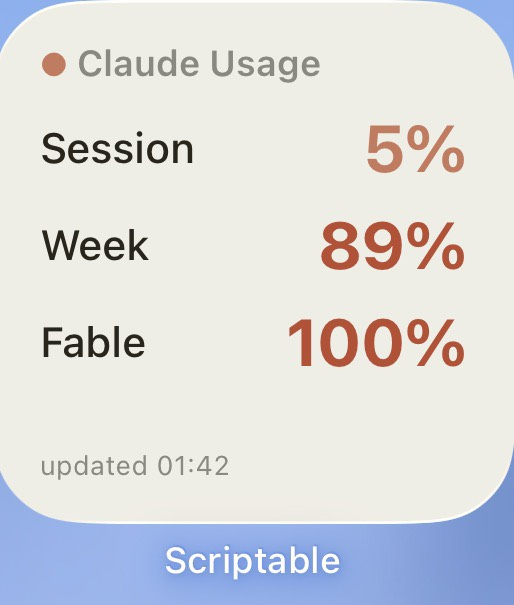

# claude-usage-monitor

Expose Claude Code `/usage` (session / weekly / Fable limits) as a private JSON API and
show it in an iPhone **Scriptable** widget.

<p align="center">
  
</p>

## How it works

Two delivery options (get-usage.sh feeds both):

```
A) push model (recommended, no inbound):
   tmux (claude /usage) → get-usage.sh → Upstash Redis (REST) → Scriptable widget (read-only token)

B) self-host:
   tmux (claude /usage) → get-usage.sh → usage.txt → server.py (Docker) → Cloudflare Tunnel → widget
```

Option A needs no public exposure — the collector only makes an outbound HTTPS POST, and
the widget reads with a **read-only** token. Set `UPSTASH_*` in `.env` to enable it.

| Component | File | Role |
|---|---|---|
| Collector | `get-usage.sh` | scrape `/usage` from a tmux `claude` session, parse %s into `usage.txt` |
| API | `server.py` + `docker-compose.yml` | stdlib HTTP server, API-key auth, JSON output |
| Widget | `claude-usage-widget.js` | Scriptable widget (Home + Lock Screen), Anthropic theme |
| Probes | `probe.sh`, `sustain-test.sh` | tooling used to find a safe polling interval |

## Setup

```bash
cp .env.example .env
# put a random 32-char key in .env:
head -c 48 /dev/urandom | base64 | tr -dc 'A-Za-z0-9' | head -c 32   # paste into API_KEY=
docker compose up -d
```

API:
- `GET /health` — public
- `GET /usage` — needs `X-API-Key: <key>` (or `Authorization: Bearer <key>`)
  ```json
  {"session_pct":5,"week_pct":89,"fable_pct":100,"fable_status":"ok","updated":"...+07:00"}
  ```
  When the Fable bar is rate-limited/absent: `"fable_pct":null,"fable_status":"rate_limited"`.

Cron (collector):
```cron
*/5 * * * * bash -c /path/to/claude-usage/get-usage.sh
```

## ⚠️ Rate limit — poll every 5 minutes, not faster

`/usage` reads a server-side endpoint cached ~5 min. Polling too often rate-limits the
per-model breakdown and **hides the Fable bar**. Measured on this account:

| interval | result |
|---|---|
| 1 min | throttled |
| 2 min | survived 5 calls, throttled on the 6th (~10–12 min) |
| 5 min | safe (matches the cache window) |

Recovery from a throttle takes **>8 minutes**. The iOS widget only refreshes every
~15–30 min anyway, so faster polling gives no real benefit. **Use `*/5`.**

## Widget

Edit the config block in `claude-usage-widget.js`:
```js
const API_URL  = "https://<your-tunnel-host>/usage"
const API_KEY  = "YOUR_API_KEY_HERE"
const BG_COLOR = "#F0EEE6"   // Home background; or set per-widget via the Parameter field
```
Paste into Scriptable, then add it to the Home screen (Small/Medium) or Lock screen
(circular / rectangular / inline). Lock-screen widgets are tinted by iOS — background
color applies to Home only.
